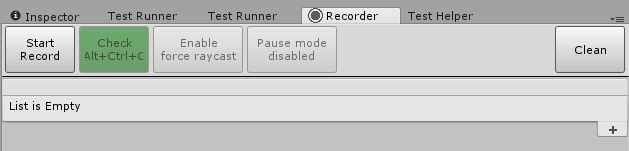
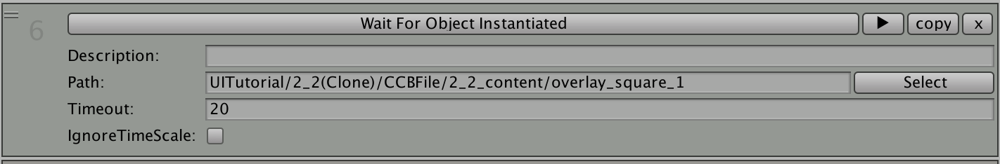
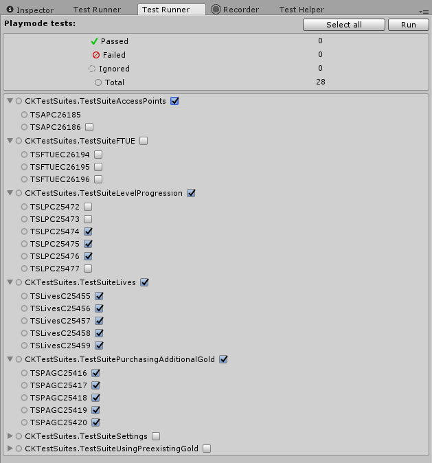
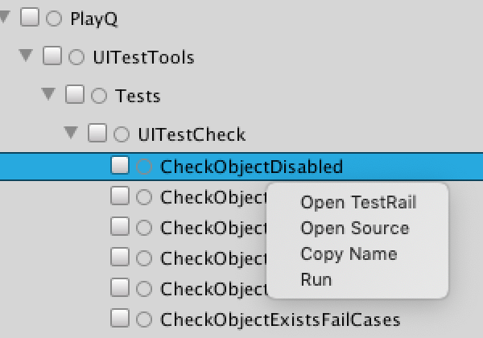
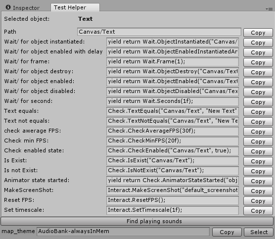

# UI Test Tool

## Content

* [About](#about)
	* [Installation](#installation)
	* [Flow Recorder](#flow-recorder)
	* [How Flow Recorder works](#how-flow-recorder-works)
	* [Recording a new test](#recording-a-new-test)
	* [Test Runner](#test-runner)
		* [Run specific list of tests](#run-specific-list-of-tests)
		* [Smoke testing](#smoke-testing)
		* [Screen resolution depending tests](#screen-resolution-dependant-tests)
        * [TestRails support](#testrails-support)
        * [Test context menu](#test-context-menu)
	* [Helper Window](#helper-window)
	* [Command Line Arguments](#command-line-arguments)
* [API methods](#api-methods)
* [Extending Test Tool](#extending-test-tool)
	* [Example 1](#example-1) 
	* [ShowInEditor](#showineditor)
	* [How Recording works with Assertations](#how-recording-works-with-assertations)
	* [Example 2](#example-2)
	* [Another Camera](#another-camera)


## About

This `Test Tool` simplifies testing of `Unity` games and allows to run tests on mobile devices. It's based on methods, attributes, and logs, similar to those in [NUnit](http://nunit.org).


### Installation

Just copy `UITestTools` folder and paste it wherever you want inside `Assets` folder of your project.


### Flow Recorder

`Flow Recorder` is an Unity Editor extension that allows to record user actions and generate test's source code from them.

To use `Test Recorder` navigate to `Window => Ui test tools => Flow recorder`, or press `Ctrl+T` for Windows and `Cmd+T` for Mac.



* `Start Record` button - enables recording mode. Once enabled, user's mouse input (LMB clicks) is recorded into test actions and appended to test's action list.
* `Stop Record` - disables recording mode. All previously recorded actions are serialized automatically.
* `Check` - toggles mode, in which clicks on UI buttons don't trigger them. The window will be colored green when check mode is enabled.
* `Pause mode` - sets current timescale to 0 in play mode. Used in situations where user needs to emulate game pause yet still be able to record new actions.
* `Clean` - deletes all previously recorded actions.
* `+` button - manually adds new "empty" user action. Provides access to actions that don't require `GameObject` to be executed.
* `Generate Code and Copy` - generate source code for test based on recorded user actions.

Recorded users actions are visually displayed as a list. User can edit recorded actions by selecting necessary assertation type, editing arguments, drag-and-dropping actions inside the list to change execution order, adding or removing actions manually.

Each action contains the following information:



* `6` - action's index in the list.
* `Assertation Type` - a drop-down menu with a list of assertation types, available for current `GameObject`. Each assertation has its own list of required arguments.
* `Description` - a brief description to selected `assertation method`. Results in a commentary above assertation method call in the generated source code
* `Path` - path in the scene hierarchy to the `GameObject` user interacted with. `Select` button allows to select the specified `GameObject`
* `TimeOut`, `IgnoreTimeScale` - selected assertation's arguments list. Argument values can be edited by user. Available arguments types are `enum`, `int`, `float`, `bool`, `string`.
* `►` - taplies assertation in runtime.
* `Copy` - duplicates selected asertation and places the copy next to it. Hotkeys are `Ctrl+D` for Windows and `Cmd+D` for Mac.
* `x` - removes selected action from list.
* `select` - displays the location of the object


### How Flow Recorder works

When you perform a LMB click in the `Game Window` during `Unity` play mode, `Flow Recorder` obtains click coordinates and uses `UnityEngine.EventSystems.EventSystem` class to raycast by these coordinates to find the `GameObject` user clicked. Then `Flow Recorder` looks through a list of all existing `assertations` and checks which `assertation` could be applied to the `GameObject`.

For example, if user clicked on UI text - all `assertations` that compare text labels become available. Common `assertations`, like `Is Enable` or `Is Exist` are available for any `GameObject`. By default, `Flow Recorder` supports only `Unity UI` raycast targets. If a support for `GameObject`s that don't have any UI components attached or use of custom `assertations` is required you have to implement custom `assertation method`. Please read below how to [extend](#extending-test-tool) `UI Test Tool`.


### Recording a new test

Launch the game from the editor, press `Start Record` button to start recording actions, perform any desired actions in the game window, then press 'Stop Record' button to stop recording. You can change assertation types or parameters and change action order during the test recording or any time after it. Press `Generate Code and Copy` to generate and obtain the source code for the test. Then you can paste the generated code to your own test class.

Also, you can create new assertation for the object by `Right Click`ing it in the hierarchy and selecting `Create Assertation`.


### Test Runner

To open `Test Runner Window` navigate to `Window => Runtime Test Runner`.



`Test Runner` searches the project for all methods with the attribute `[UnityTest]` and represents them as a tree structure with namespaces and classes as branches and methods as leaves. Press `Run all` to run all tests.

You can select the number of times each test is run by dragging the `Repeat Tests N Times` slider.

Also, you can change the `TimeScale` value applied to game environment before the test run by dragging the `Default Timescale` slider.

One of the greatest features of the `Test Runner` tool is that it allows to run tests directly on target devices. See command line arguments for it in [Command line](#command-line-arguments) section.


##### Run specific list of tests

You can select specific tests that you want to run and press the `Run` button. The set of selected tests is saved to `UITestTools/PlayModeTestRunner/Resources/SelectedTests.asset` scriptable object. 

When you run tests on mobile device `Play Mode Test Runner` tool loads `SelectedTests` asset and performs only selected tests. If `SelectedTests` asset does not exist - all tests will be performed.


##### Smoke testing

You can mark any test with `[SmokeTest]` attribute. Clicking the `Rum Smoke` button allows to perform only tests marked with this attribute.

For example:

``` c#
[SmokeTest]
[UnityTest]
public IEnumerator SomeTest()
{
	// some code 
}
```


##### Screen resolution dependant tests

Sometimes, tests may succeed or fail depending on the different screen resolution. For example, the test checks whether a specific `GameObject` is located at the certain screen pixel coordinates. To ensure that the test is run only at the proper resolution you have to add `[EditorResolutionAttribute]` attribute above test method declaration and specify target resolution for Editor. It doesn't affect tests that are performed on devices.

Also, you can add any amount of `TargetResolutionAttribute` attributes to test. If device resolution matches not any of them, the test is ignored. If `EditorResolutionAttribute` is not set, `TargetResolutionAttribute` values are used for Editor Resolution.

For example:
```c#
[TargetResolution(1920, 1080)]
[TargetResolution(1334, 750)]
[TargetResolution(1136, 640)]
[EditorResolution(1920, 1080)]
[UnityTest]
public IEnumerator SomeTest()
{....}
```


#### TestRails support
You add link to test description in TestRails with attribute `TestRailAttribute`. `TestRailAttribute` constructor takes 2 arguments:
`string subdomen` and `int testId`.
For example if link to your test looks like this:

`https://TESTRAILS_PROJECT_NAME.testrail.net/index.php?/cases/view/12345`

where `12345` is some test id. Then you have to declare test method like that:

```c#
[TestRail("TESTRAILS_PROJECT_NAME", 12345)]
[UnityTest]
public IEnumerator SomeTest()
{....}
```

To use that link you have to right click on test name in TestRunner window and choose `Open TestRail` in [context menu](#test-context-menu).


#### Test context menu
You can open test context menu by right click on it's name in TestRunner window.



* `Open TestRails` - opens Testrail webpage with description of selected test. This option is shown only if you've added `TestRail` attribute to test method.
* `Open Source` - opens .cs file with name equals to method's class name. If file contains test method name it will open source on corresponding line. This option is shown only if such file exists. 
* `Copy Name` - copies full name of test method with namespace.
* `Run` - simply runs specific test method.


### Helper Window

`Test Helper` navigate to `Window` => `Helper` that shows a list of possible assertations for the selected `GameObject` in `Hierarchy` and corresponding code lines next to them. In play mode `Test Helper` allows user to obtain the list of sound clips that are currently playing.



* `Copy` - copies assertation's generated code.
* `Find playing sounds` - searches for currently playing sound clips.
* `Select` - used for sounds only, selects the `GameObject` in hierarchy which has `Audio Source` component and it's `Sound Clip` is playing a sound.


### Command Line Arguments

To run tests in Editor Mode via command line use the following command:

```
Unity.exe 
 -projectPath project_path
 -executeMethod TestToolBuildScript.RunPlayModeTests
 -runOnlySelectedTests 
 -runOnlySmokeTests
 -timeScale time_scale
`-buildNumber` - build_numer
```

* `-projectPath` - absolute path to project folder (Unity attribute);
* `-runOnlySelectedTests` - optional, runs only tests selected in `Play Mode Test Runner` window;
* `-runOnlySmokeTests` - optional, runs test with `SmokeTest` attribute only;
* `-timeScale` - timescale for tests;
* `-buildNumber` - used as postfix for file with test metrics.


To create test build to run tests on the target device use `TestToolBuildScript.TestBuild` method instead of `TestToolBuildScript.RunPlayModeTests`:

```
Unity.exe 
 -projectPath project_path 
 -testBuildPath result_path
 -executeMethod TestToolBuildScript.TestBuild
 -runOnlySelectedTests 
 -runOnlySmokeTests
 -buildNumber build_numer
 -timeScale time_scale
```

Arguments are equal in both methods.


API methods
--------

`Test Tool` common actions are split to 5 static partial classes: `Check`, `Wait`, `Interact`, `AsyncCheck` and `AsyncWait`. Each of these classes contain a list of methods which perform a corresponding action like checking the state of the given object, waiting for specific condition or interacting with specific object.

For example:

```c#
yield return Wait.ObjectEnabled("SpeechBubble/avatar_king", 20f);
Check.CheckEnabled("content/overlay_square");
Check.CheckEnabled("content/overlay_square_5");
Check.CheckEnabled("content/speech bubble/SpeechBubble/speech bubble");
Check.TextMeshProEquals("content/CCLabelBMFontv2", "Match 4 to enchant the feather charms you need in the row.");
Check.CheckEnabled("content/pointer finger/SwipeAnim/pointer_finger");
yield return Interact.SwipeCell(4, 7, Interact.SwipeCellClass.SwipeDirection.Down, true, 1f);
```

`Async` actions allow user to delay their finish conditions check until the following actions are finished.

For example:

```c#
var soundCheck = AsyncCheck.CheckSoundPlaying("button_sound");
yield return Interact.WaitDelayAndClick("LayoutComponent/ButtonCherryTree", 0, 20f);
yield return soundCheck;
```

### [See full list of all assertations here!](APIREADME.md)


Extending Test Tool
-----------

You can extend any of 5 common test actions classes (`Check`, `Wait`, `Interact`, `AsyncCheck` and `AsyncWait`) with new sets of actions using partial class modifier.


### Example 1

The following example shows how to create a simple assertation method, which retrieves `GameObject` from hierarchy by path that is passed as an argument, checks whether it has user-defined custom component `LevelButton` attached and checks the stars count on it. The method is placed its in own partial `Check` class.

``` c#
public static partial Check
{

...

    public static void StarsCount(string path, int startCount) //path is a full path of GameObject in hierarchy on scene
    {
        var go = IsExist(path); //if object not exist, exception will be thrown and test failed
        var levelButton = go.GetComponent<LevelButton>();
        //lest fail test, if component doesn't present on the object
        if (levelButton == null)
        {
            Assert.Fail("StarsCount: " + path + " object is exist, but LevelButton component not found.");
        }
        Assert.AreEqual(levelButton.StartCount, startCount, "Start Count is not equals.");
    }
}
```

The method is now available to be used in tests as an action:

``` c#
[UnityTest]
public IEnumerator SomeIntegrationTest()
{
	// some code 
	
	Check.StarsCount("Level3/Button", 2);
}
```

Let's create a class that informs [Flow Recorder](#flow-recorder) when and how it should display the action created in the previous code snippet. The class is required to be inherited from `ShowHelperBase` class and implement `CreateGenerator()` method. `CreateGenerator` method is responsible for defining which editable arguments the action has, their default values and how to generate its source code. 

`bool IsAvailable(GameObject go)` method is overridable. It typically indicates whether an assertation is available for the current `GameObject`. By default it returns `true`, even if `GameObject` is `null`. User can override method `Camera GetCamera()` to specify which camera should be used by Flow Recorder to raytrace the desired `GameObject`.

User can override method `Camera GetCamera()` to specify which camera should be used by Flow Recorder to raytrace the desired `GameObject`. [See more below](#another-camera).

```c#
private class CheckStarsCount : ShowHelperBase
{
    public override bool IsAvailable(GameObject go)
    {
        if (!go)
        {
            return false; //not available if game object is null
        }
	//not available if game object doen't containce LevelButton component
        return go.GetComponent<LevelButton>() != null;
    }

    public override AbstractGenerator CreateGenerator(GameObject go)
    {
        var levelButton = go.GetComponent<LevelButton>();
	//tell Flow Recorder about params and default values
        return VoidMethod.Path(go).Int(levelButton.StartCount);
	//if method is IEnumerator, use IEnumeratorMethod instead VoidMethod.
    }
}
```

Let's bind our method to class.

``` c#
[ShowInEditor(typeof(CheckStarsCount), "Check Start Count on Button")]
public static void StarsCount(string path, int startCount) //path is a full path of GameObject in hierarchy on scene
{
    var go = IsExist(path); //if object not exist, exception will be thrown and test failed
    var levelButton = go.GetComponent<LevelButton>();
    //lest fail test, if component doesn't present on the object
    if (levelButton == null)
    {
        Assert.Fail("StarsCount: " + path + " object is exist, but LevelButton component not found.");
    }
    Assert.AreEqual(levelButton.StartCount, startCount, "Start Count is not equals.");
}
```

The action can now be seen in `Flow Recorder` actions list as `Check Start Count on Button` upon clicking a `GameObject` with `LevelButton` component attached.


### ShowInEditor

`ShowInEditorAttribute` receive 3 arguments in constructor:

* `Type classType` - type of `ShowHelperBase` class to be applied to the action;
* `string description` - assertation's brief description (shown in recorder's dropdown list of assertations);
* `bool isDefault` false - optional argument that indicates whether this assertation should be used to selected `GameObject` by default. In case of multiple default assertations available recorder resolves it by selecting one of them,


### How Recording works with Assertations

When user taps on a `GameObject` on the game screen, `Flow Recorder` looks through all assertation methods with a `ShowInEditor` attribute. `Flow Recorder` then finds suitable `EditorHelpers` and passes the instance of selected `GameObject` to their `IsAvailable` methods. If any of those methods return true then appropriate assertation method is selected to be shown in the list of assertation methods in `Flow Recorder` UI. Finally `Flow Recorder` looks for a method with `isDefault` value set to true and sets it as a selected assertation for the action.


Sometimes target `GameObjects` contain child `GameObjects` which can be raycast targets as well. This may lead to unpredicted behaviour in the `Flow Recorder`. For example, you tap on a text label, but the recorder choses the background image containing `GameObject` as a target instead. To address this issue `Flow Recorder` passes target `GameObject` to `IsAvailabel` method and if it returns `false`, `Flow Recored` passes its parent `GameObject` to `IsAvailabel` method recursively, until it returns `true` or parent is `null`.


### Example 2

Here's an example of another assertation method which checks some specific game mechanics: assume we have a `ScreenManager` `MonoBehaviour` present on a scene with a string property of current active screen, and we want to check if lobby screen is active.

``` c#
[ShowInEditor(typeof(CheckIsScreenActive), "Check Current Screen")]
public static void IsScreenActive(string screenName)
{
    // FindAnyGameObject has overload to seach for GameObject with given type of component.
    var screenManager = UITestUtils.FindAnyGameObject<ScreenManager>();
    if (!screenManager)
    {
        Assert.Fail("IsScreenActive: no ScreenManager found");
    }
    Assert.AreEquals(screenManager.CurrentScreen, screenName);
}

private class CheckIsScreenActive : ShowHelperBase
{
    public override AbstractGenerator CreateGenerator(GameObject go)
    {
        return VoidMethod.String(ScreenManager.CurrentScreen);
    }
}
```

Example of a test with this assertation:

``` c#
[UnityTest]
public IEnumerator SomeIntegrationTest()
{
	// some code 
	
	Check.IsScreenActive("Lobby_Screen");
}
```

### Another Camera


When user clicks on UI element (button, switch etc) `Flow Recorder` receives click coordinates and uses `UnityEngine.EventSystems.EventSystem` class to raycast by these coordinates to find the `GameObject` user clicked. This works only with `GameObjects` containing Unity UI elements. In case user needs to click on the `GameObject` with no UI element attached he needs to define property in `Class Helper` that returns specific camera to perform raycast from. 


```c#
static class MapLocationClick
{
    public static Camera Camera
    {
        get
        {
            // return custom game Camera to raycast to specific GameObject
            return Map.mapCamera; 
        }
    }
}
```
